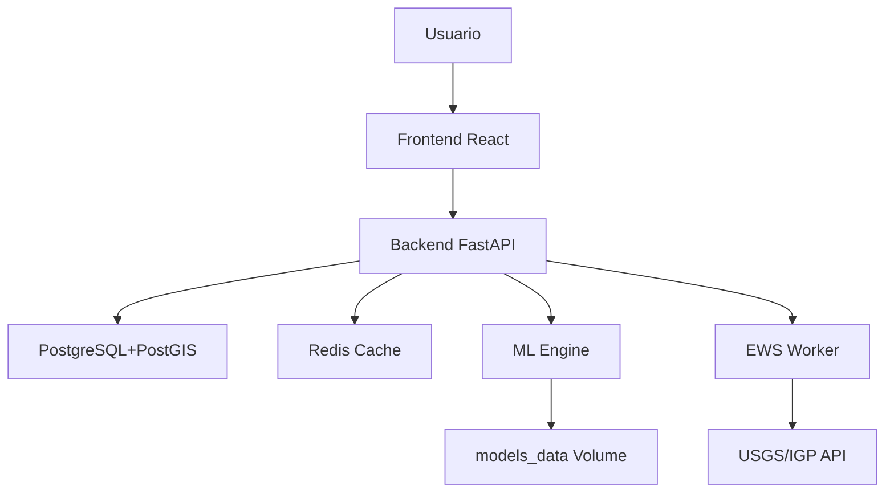

# 🏗️ GeoRiesgo Perú — Arquitectura del Sistema

> **Documento de Arquitectura Técnica** — Plataforma Multi-Amenaza con ML y EWS  
> Versión: 10.0 | Última actualización: Junio 2026

---

## 📋 Tabla de Contenidos

1. [Resumen Ejecutivo](#1-resumen-ejecutivo)
2. [Principios Arquitectónicos](#2-principios-arquitectónicos)
3. [Arquitectura de Alto Nivel](#3-arquitectura-de-alto-nivel)
4. [Arquitectura de Componentes](#4-arquitectura-de-componentes)
5. [Arquitectura de Datos](#5-arquitectura-de-datos)
6. [Arquitectura del Backend](#6-arquitectura-del-backend)
7. [Arquitectura del Frontend](#7-arquitectura-del-frontend)
8. [Arquitectura ML](#8-arquitectura-ml)
9. [Arquitectura del EWS](#9-arquitectura-del-ews)
10. [Arquitectura de Despliegue](#10-arquitectura-de-despliegue)
11. [Arquitectura de Seguridad](#11-arquitectura-de-seguridad)
12. [Arquitectura de Caché](#12-arquitectura-de-caché)
13. [Decisiones de Diseño (ADR)](#13-decisiones-de-diseño-adr)
14. [Diagramas de Secuencia](#14-diagramas-de-secuencia)
15. [Métricas y Observabilidad](#15-métricas-y-observabilidad)
16. [Cambios v10.0](#16-cambios-v100)
17. [Glosario](#17-glosario)

---

## 1. Resumen Ejecutivo

**GeoRiesgo Perú** es una plataforma geoespacial full-stack diseñada para la evaluación integral de riesgos por amenazas naturales en el territorio peruano. El sistema integra:

- **18+ fuentes de datos oficiales** (USGS, IGP, INGEMMET, SENAMHI, NOAA-CPC, GEM v2023, CENEPRED, INDECI, ANA, CAPECO, MIDIS, INEI, OVI-IGP, DHN, UNDRR, CISMID 2023, WorldPop 2020, ISC Bulletin)
- **Motor de Machine Learning v10.0** — ensemble XGBoost + RandomForest + LightGBM con SHAP + Optuna, features DEM reales via USGS EPQS, target multiclase 0-4 (Medina et al. 2024 Nat. Hazards)
- **Sistema de Alerta Temprana (EWS) v10.0** — multi-fuente: IGP RSS + ISC Bulletin + PTWC CAP + USGS ATOM; cascada Markov (Tadesse et al. 2024 NHESS)
- **Modelo de Daño Sísmico v10.0** — GMPE BC Hydro 2016 (Abrahamson et al. 2016 Eq. Spectra), Vs30 CISMID 2023, geometría 3D Slab2 (Hayes et al. 2018)
- **Índice de Riesgo Compuesto (IRC v10)** — 8 amenazas + factor Vs30 (Stewart et al. 2016 NGA-West2) + WorldPop 2020 + bootstrap de incertidumbre
- **Mapa interactivo 2D/3D** con 15+ capas WebGL aceleradas por GPU

### 1.1 Stakeholders

| Stakeholder | Interés |
|---|---|
| Defensa Civil / INDECI | Evaluación de riesgo y alertas tempranas |
| Gobiernos Regionales | Planificación territorial y mitigación |
| Academia e Investigación | Datos sísmicos y modelos ML |
| Público General | Consulta de zonas de riesgo |

---

## 2. Principios Arquitectónicos

| # | Principio | Descripción |
|---|---|---|
| **P1** | **Separation of Concerns** | Frontend, Backend, Base de Datos y Caché son servicios independientes orquestados por Docker Compose |
| **P2** | **Stateless API** | El backend FastAPI no mantiene estado de sesión; toda la persistencia delega en PostgreSQL/Redis |
| **P3** | **Caching First** | Las respuestas GeoJSON frecuentes se cachean en Redis con TTL configurable |
| **P4** | **Resiliencia** | Reintentos exponenciales con jitter, circuit breaker para fuentes externas, fallback heurístico para ML |
| **P5** | **Seguridad por Capas** | CORS, rate limiting, consultas parametrizadas, headers de seguridad, allowlist para MV |
| **P6** | **Explicabilidad ML** | SHAP TreeExplainer para todas las predicciones — no cajas negras |
| **P7** | **Observabilidad** | Logging estructurado, healthchecks, métricas de caché y EWS |
| **P8** | **Lazy Loading** | Carga bajo demanda de capas del mapa para optimizar rendimiento inicial |

---

## 3. Arquitectura de Alto Nivel

### 3.1 Diagrama de Contexto (C4 — Nivel 1)

```
┌─────────────────────────────────────────────────────────────────────────────────────────┐
│                              SISTEMA: GeoRiesgo Perú                                    │
│                                                                                         │
│  ┌──────────────┐   ┌──────────────────┐   ┌──────────────┐   ┌──────────────────────┐ │
│  │   Usuario    │   │   Frontend       │   │   Backend    │   │   PostgreSQL/PostGIS  │ │
│  │  (Navegador) │──►│   React 19       │──►│   FastAPI    │──►│   (Base de Datos)    │ │
│  │              │◄──│   deck.gl        │◄──│   Uvicorn    │◄──│                       │ │
│  └──────────────┘   │   MapLibre GL    │   │   ML Engine  │   └──────────────────────┘ │
│                     └──────────────────┘   │   EWS Worker  │                           │
│                                            │   Damage Mod. │                           │
│                                            └───────┬───────┘                           │
│                                                    │                                   │
│                                            ┌───────▼───────┐   ┌────────────────────┐  │
│                                            │    Redis 7    │   │  Fuentes Externas  │  │
│                                            │   Cache LRU   │   │  USGS, IGP, GADM, │  │
│                                            │   Pub/Sub     │◄──│  INGEMMET, ANA,   │  │
│                                            └───────────────┘   │  OSM, etc.        │  │
│                                                                 └────────────────────┘  │
└─────────────────────────────────────────────────────────────────────────────────────────┘
```

### 3.2 Diagrama de Contenedores (C4 — Nivel 2)

```
┌─────────────────────────────────────────────────────────────────────────────────────┐
│                          DOCKER COMPOSE ENVIRONMENT                                  │
│                                                                                     │
│  ┌─────────────────────────────────────┐                                            │
│  │         FRONTEND CONTAINER          │                                            │
│  │  ┌──────────────┐  ┌─────────────┐ │                                            │
│  │  │ Nginx 1.27   │  │ React App   │ │                                            │
│  │  │ (Static)     │  │ (SPA)       │ │                                            │
│  │  │ :80          │  │ deck.gl     │ │                                            │
│  │  │              │  │ MapLibre    │ │                                            │
│  │  │ Proxy /api/  │  │ Recharts    │ │                                            │
│  │  └──────┬───────┘  └─────────────┘ │                                            │
│  └─────────┼───────────────────────────┘                                            │
│            │ HTTP                                                                    │
│  ┌─────────▼───────────────────────────┐                                            │
│  │         BACKEND CONTAINER           │                                            │
│  │                                     │                                            │
│  │  ┌──────────────────────────────┐   │   ┌────────────────────────────┐          │
│  │  │     FastAPI Application      │   │   │    ETL Pipeline            │          │
│  │  │  ┌──────┐ ┌──────┐ ┌──────┐ │   │   │  ┌──────────────────────┐  │          │
│  │  │  │REST  │ │WS    │ │SSE   │ │   │   │  │procesar_datos.py     │  │          │
│  │  │  │API   │ │      │ │      │ │   │   │  │ 20 pasos secuenciales│  │          │
│  │  │  └──┬───┘ └──┬───┘ └──┬───┘ │   │   │  │ con dependencias    │  │          │
│  │  │     │        │        │     │   │   │  └──────────────────────┘  │          │
│  │  │  ┌──▼────────▼────────▼───┐  │   │   └────────────────────────────┘          │
│  │  │  │   Cache Layer (Redis)  │  │   │                                            │
│  │  │  └────────────────────────┘  │   │   ┌────────────────────────────┐          │
│  │  │                              │   │   │    ML Engine               │          │
│  │  │  ┌────────────────────────┐  │   │   │  ┌──────────────────────┐  │          │
│  │  │  │   Damage Model         │  │   │   │  │ml_engine.py          │  │          │
│  │  │  │   (Youngs 1997)        │  │   │   │  │ XGBoost + SHAP       │  │          │
│  │  │  └────────────────────────┘  │   │   │  │ + Optuna + SMOTE     │  │          │
│  │  │                              │   │   │  └──────────────────────┘  │          │
│  │  │  ┌────────────────────────┐  │   │   └────────────────────────────┘          │
│  │  │  │   EWS Alert Worker     │  │   │                                            │
│  │  │  │   (Polling 30s)        │  │   │   ┌────────────────────────────┐          │
│  │  │  └────────────────────────┘  │   │   │    STAC Catalog           │          │
│  │  └──────────────────────────────┘   │   │  (opcional, req. MinIO)   │          │
│  │                                     │   └────────────────────────────┘          │
│  └─────────────────────────────────────┘                                            │
│                                                                                     │
│  ┌─────────────────────┐  ┌─────────────────────┐  ┌─────────────────────┐         │
│  │   PostgreSQL 17     │  │     Redis 7 Alpine  │  │   models_data       │         │
│  │   + PostGIS 3.6     │  │   Cache LRU 128 MB  │  │   (Volumen Docker)  │         │
│  │   :5432             │  │   :6379             │  │   Modelos .pkl      │         │
│  └─────────────────────┘  └─────────────────────┘  └─────────────────────┘         │
└─────────────────────────────────────────────────────────────────────────────────────┘
```

---

## 4. Arquitectura de Componentes

### 4.1 Catálogo de Componentes

| Componente | Tecnología | Propósito | Dependencias |
|---|---|---|---|
| **API Gateway** | Nginx 1.27 | Servir frontend estático + redirigir `/api/` al backend | Frontend build, Backend |
| **REST API** | FastAPI 0.115 | 30+ endpoints REST + WS + SSE | PostgreSQL, Redis |
| **ML Engine** | XGBoost + SHAP + Optuna | Entrenamiento y predicción de susceptibilidad | PostgreSQL, models_data |
| **Damage Model** | NumPy, SciPy | Simulación de escenarios de daño sísmico | — |
| **EWS Worker** | httpx + asyncio | Polling de fuentes sísmicas + alertas | Redis pub/sub |
| **ETL Pipeline** | asyncpg, httpx | Carga inicial de 15+ fuentes de datos | PostgreSQL |
| **Cache Layer** | Redis 7 | Caché LRU de respuestas GeoJSON | Redis |
| **STAC Catalog** | pystac, boto3 | Catálogo de activos geoespaciales (opcional) | MinIO |
| **Frontend SPA** | React 19 + TS 5.9 | Interfaz de usuario interactiva | Backend API |
| **Map Engine** | MapLibre 5.19 + deck.gl 9.2 | Visualización geoespacial 2D/3D | Frontend |
| **Database** | PostgreSQL 17 + PostGIS 3.6 | Persistencia de datos geoespaciales | — |

### 4.2 Matriz de Comunicación entre Componentes

```
Componente         │ API GW  │ REST    │ ML Eng  │ EWS     │ Cache   │ DB      │ Front   │ Redis
───────────────────┼─────────┼─────────┼─────────┼─────────┼─────────┼─────────┼─────────┼───────
API Gateway (Ngx)  │    —    │  HTTP   │    —    │    —    │    —    │    —    │  HTTP   │   —
REST API           │  HTTP   │    —    │  sync   │  async  │  async  │  async  │    —    │ async
ML Engine          │    —    │  sync   │    —    │    —    │    —    │  async  │    —    │   —
EWS Worker         │    —    │  async  │    —    │    —    │    —    │  async  │    —    │ async
Cache Layer        │    —    │  async  │    —    │    —    │    —    │    —    │    —    │ async
Database           │    —    │  async  │  async  │  async  │    —    │    —    │    —    │   —
Frontend           │  HTTP   │    —    │    —    │    —    │    —    │    —    │    —    │   —
Redis              │    —    │  async  │    —    │  async  │  async  │    —    │    —    │   —
```

---

## 5. Arquitectura de Datos

### 5.1 Modelo de Datos — Diagrama Entidad-Relación

```
┌─────────────────┐     ┌──────────────────┐     ┌──────────────────┐
│   departamentos │     │    distritos     │     │     sismos       │
├─────────────────┤     ├──────────────────┤     ├──────────────────┤
│ PK id_dep       │◄────┤ FK id_dep        │     │ PK usgs_id      │
│ nombre          │     │ PK id_dist       │     │ magnitud        │
│ geom (Polygon)  │     │ nombre           │     │ profundidad     │
│ zona_sismica    │     │ geom (Polygon)   │     │ lugar           │
└─────────────────┘     │ peligro_sismo    │     │ geom (Point)    │
                        │ peligro_inundac  │     │ timestamp       │
┌─────────────────┐     │ peligro_desliz   │     └──────────────────┘
│     fallas      │     │ peligro_sequia   │
├─────────────────┤     │ peligro_tsunami  │     ┌──────────────────┐
│ PK id_falla     │     │ peligro_volcan   │     │  infraestructura │
│ nombre          │     │ peligro_fallas   │     ├──────────────────┤
│ tipo            │     │ irc_v9           │     │ PK id_infra      │
│ geom (Line)     │     │ irc_v9_p10       │     │ tipo             │
└─────────────────┘     │ irc_v9_p90       │     │ nombre           │
                        │ clasif_suelo     │     │ fuente           │
┌─────────────────┐     │ factor_suelo_s   │     │ geom (Point)     │
│    volcanes     │     │ mmi_estimada     │     └──────────────────┘
├─────────────────┤     └──────────────────┘
│ PK id_volcan    │            │                    ┌──────────────────┐
│ nombre          │            │                    │  alertas_ews     │
│ estado          │            ▼                    ├──────────────────┤
│ peligro         │     ┌──────────────────┐        │ PK id_alerta     │
│ geom (Point)    │     │ modelo_metadata  │        │ nivel            │
└─────────────────┘     ├──────────────────┤        │ mensaje          │
                        │ PK id_modelo     │        │ cap_version      │
┌─────────────────┐     │ amenaza          │        │ timestamp        │
│  precipitaciones│     │ auc_roc          │        │ geom (Point)     │
├─────────────────┤     │ auc_pr           │        └──────────────────┘
│ PK id_precip    │     │ features         │
│ zona            │     │ hiperparametros  │        ┌──────────────────┐
│ indice_fen      │     │ timestamp        │        │  estaciones      │
│ spi12           │     └──────────────────┘        ├──────────────────┤
│ geom (Polygon)  │                                 │ PK id_estacion   │
└─────────────────┘     ┌──────────────────┐        │ nombre           │
                        │ eventos_fen      │        │ institucion      │
┌─────────────────┐     ├──────────────────┤        │ tipo             │
│  zonas_inundables│    │ PK id_evento     │        │ geom (Point)     │
├─────────────────┤     │ nombre           │        └──────────────────┘
│ PK id_inundac   │     │ tipo (nino/nina) │
│ tipo            │     │ intensidad       │        ┌──────────────────┐
│ periodo_retorno │     │ anno             │        │ mv_riesgo_const  │
│ geom (Polygon)  │     └──────────────────┘        │ (vista material) │
└─────────────────┘                                 ├──────────────────┤
                                                    │ id_dist          │
┌─────────────────┐     ┌──────────────────┐        │ irc_v9           │
│  zonas_tsunami  │     │   sendai_snap    │        │ clasif_suelo     │
├─────────────────┤     ├──────────────────┤        │ factor_suelo_s   │
│ PK id_tsunami   │     │ PK id_snap       │        │ mmi_estimada     │
│ altura_ola      │     │ target_a..g      │        │ mag_max_cercana  │
│ tiempo_arribo   │     │ timestamp        │        │ geom (Polygon)   │
│ geom (Polygon)  │     └──────────────────┘        └──────────────────┘
└─────────────────┘
```

### 5.2 Vistas Materializadas

| Vista | Propósito | Frecuencia Refresh |
|---|---|---|
| `mv_heatmap_sismos` | Datos pre-agregados para ScreenGridLayer | Por demanda (paso 17 ETL) |
| `mv_riesgo_construccion` | IRC v9 + clasificación suelo + MMI por distrito | Por demanda (paso 19 ETL) |

### 5.3 Índices Geoespaciales

```sql
-- Índices espaciales GIST (búsqueda por proximidad)
CREATE INDEX idx_sismos_geom     ON sismos     USING GIST (geom);
CREATE INDEX idx_distritos_geom  ON distritos  USING GIST (geom);
CREATE INDEX idx_departamentos_geom ON departamentos USING GIST (geom);
CREATE INDEX idx_infraestructura_geom ON infraestructura USING GIST (geom);
CREATE INDEX idx_estaciones_geom ON estaciones USING GIST (geom);

-- Índices SP-GiST (búsqueda por partición espacial)
CREATE INDEX idx_fallas_geom     ON fallas     USING SP-GiST (geom);

-- Índices funcionales B-tree
CREATE INDEX idx_sismos_mag      ON sismos (magnitud DESC);
CREATE INDEX idx_sismos_ts       ON sismos ("timestamp" DESC);
CREATE INDEX idx_distritos_irc   ON distritos (irc_v9 DESC);
```

### 5.4 Políticas de Retención de Datos

| Tabla | Retención | Estrategia |
|---|---|---|
| `sismos` | Indefinido (histórico 1900–) | Datos inmutables, solo inserción |
| `alertas_ews` | 90 días | Rotación por DELETE batch mensual |
| `sendai_snap` | Indefinido | Snapshot por versión |
| `modelo_metadata` | Indefinido | Histórico de entrenamientos |
| Cache Redis | TTL por endpoint (30s–300s) | LRU eviction automática |

---

## 6. Arquitectura del Backend

### 6.1 Estructura de Módulos

```
backend/
├── main.py              # FastAPI app: lifespan, routers, exception handlers
├── ml_engine.py          # ML pipeline: entrenamiento + predicción + SHAP
├── alert_worker.py       # EWS: polling asíncrono + alertas + CAP v1.2
├── damage_model.py       # Youngs 1997 atenuación + curvas de fragilidad
├── procesar_datos.py     # ETL: 20 pasos con dependencias + CLI
├── cache.py              # Decorador @cached(ttl=...) + Redis stats
├── stac_catalog.py       # STAC: catálogo opcional con MinIO
├── init.sql              # DDL: 20+ tablas + PostGIS + índices + vistas
├── Dockerfile            # Multi-stage: builder + runtime slim
├── entrypoint.sh         # Entrypoint: ETL condicional + uvicorn
└── requirements.txt      # Dependencias Python
```

### 6.2 Patrones de Diseño

| Patrón | Aplicación | Ejemplo |
|---|---|---|
| **Módulo Singleton** | Conexiones a BD y Redis | `asyncpg.create_pool()` en `lifespan` |
| **Decorator** | Caché de respuestas | `@cached(ttl=120)` en endpoints |
| **Strategy** | Modelos de fragilidad | `fragility_probability()` dispatches por taxonomía |
| **Observer** | EWS alertas | Pub/sub Redis → SSE + WebSocket |
| **Pipeline** | ML preprocessing | `VIF → SMOTE → Optuna → XGBoost → SHAP` |
| **Circuit Breaker** | Fuentes externas OSM | Rotación de 3 endpoints Overpass |
| **Retry Pattern** | HTTP externo | `tenacity.retry` con exponential backoff + jitter |

### 6.3 Endpoints — Clasificación por Dominio

```
/api/v1/
├── sistema/          # Health, resumen, diagnóstico
├── sismos/           # Catálogo sísmico, heatmap, cercanos, WS
├── departamentos/    # Límites administrativos
├── distritos/        # Datos distritales con riesgo
├── fallas/           # Geología
├── deslizamientos/   # Movimientos en masa
├── volcanes/         # Actividad volcánica
├── zonas-sismicas/   # Normativa E.030
├── inundaciones/     # Zonas inundables
├── tsunamis/         # Zonas de tsunami
├── precipitaciones/  # Datos climáticos
├── fen/              # Eventos ENSO
├── infraestructura/  # Activos estratégicos
├── estaciones/       # Red de monitoreo
├── riesgo/           # IRC + escenarios + construcción
├── susceptibilidad/  # ML predicciones + entrenamiento
├── sendai/           # Marco Sendai SFDRR
├── alertas/          # EWS SSE + recap
├── cache/            # Administración de caché
└── ws/               # WebSocket en tiempo real
```

### 6.4 Manejo de Excepciones

```python
# Estructura de respuesta de error estándar
{
    "error": {
        "code": "VALIDATION_ERROR",
        "message": "Coordenadas fuera del territorio peruano",
        "details": {
            "lon": -85.0,
            "lat": -15.0,
            "bbox_peru": {"west": -84.0, "south": -18.5, "east": -68.0, "north": 0.0}
        },
        "request_id": "req_abc123"
    }
}
```

Jerarquía de excepciones:
- `GeoRiesgoException` (base)
  - `ValidationException` — coordenadas, magnitudes, parámetros inválidos
  - `NotFoundException` — recurso no encontrado
  - `CacheException` — error de Redis
  - `MLException` — error de modelo/predicción
  - `ETLException` — error de pipeline de datos

---

## 7. Arquitectura del Frontend

### 7.1 Árbol de Componentes

```
<App>
├── <ErrorBoundary> (Nivel App)
├── <ToastList />
├── <LandingPage />           # Pantalla de bienvenida
├── <MapView>                 # Mapa principal
│   ├── <LayerPanel />        # Control de capas
│   ├── <FilterPanel />       # Filtros
│   ├── <StatsChart />        # Gráficos
│   ├── <HoverTooltip />      # Tooltip hover
│   ├── <InfoPopup />         # Popup de detalle
│   ├── <RiesgoPanel />       # Panel de riesgo
│   └── <ErrorBoundary> (Nivel Mapa)
└── <Loader />                # Pantalla de carga
```

### 7.2 Flujo de Datos del Frontend

```
Componente UI
    │
    ▼
useMapData.ts (Hook Central)
    │
    ├──► Estados: idle │ loading │ success │ error │ refetching
    │
    ▼
api.ts (Servicio HTTP)
    │
    ├──► Cache local (ETag + deduplicación)
    ├──► Retry automático (3 intentos)
    ├──► Parseo GeoJSON
    │
    ▼
Backend API (/api/v1/*)
    │
    ▼
Redis Cache (TTL) ──► PostgreSQL/PostGIS
```

### 7.3 Patrones de Componentes

| Patrón | Componente | Descripción |
|---|---|---|
| **Container/Presentational** | `App.tsx` (container) ↔ `MapView.tsx` (presentational) | Separación de lógica de datos y renderizado |
| **Custom Hook** | `useMapData.ts` | Centraliza lógica de fetching, cache y estados |
| **Error Boundary** | `ErrorBoundary.tsx` | Captura errores de renderizado en subárboles |
| **Compound Components** | `LayerPanel.tsx` | Checkboxes + leyendas como hijos coordinados |
| **Render Props** | `MapView.tsx` | Callbacks de capas deck.gl expuestos a App |
| **Lazy Loading** | 6 capas con `useEffect` + estados booleanos | Carga bajo demanda al activar capas |

### 7.4 Manejo de Estado

| Tipo de Estado | Ubicación | Ejemplo |
|---|---|---|
| **UI State** | `useState` local | Panel abierto/cerrado, capa activa |
| **Server State** | `useMapData` hook | Datos GeoJSON, estadísticas |
| **URL State** | No usado (SPA pura) | — |
| **Global State** | No necesario | Comunicación vía props y callbacks |

### 7.5 Rendimiento

| Estrategia | Implementación | Impacto |
|---|---|---|
| **Lazy Loading** | 6 capas cargadas bajo demanda | -60% ancho de banda inicial |
| **ErrorBoundary** | Captura errores sin colapsar toda la app | Mejora UX |
| **ETag Caching** | api.ts con `If-None-Match` | Reduce payloads |
| **Request Dedup** | Mapa de requests inflight | Evita duplicados |
| **deck.gl GPU** | WebGL para todas las capas | 60 FPS en renderizado |
| **ColumnLayer 3D** | Extrusión GPU-accelerada | Visualización 3D eficiente |

---

## 8. Arquitectura ML

### 8.1 Pipeline de Entrenamiento

```
┌──────────┐    ┌──────────┐    ┌──────────┐    ┌──────────┐    ┌──────────┐
│  Datos   │───►│   VIF    │───►│ SMOTE-   │───►│ Optuna   │───►│ XGBoost  │
│ Distritos│    │ Filter   │    │ Tomek    │    │ 20 trials│    │ Training │
└──────────┘    └──────────┘    └──────────┘    └──────────┘    └─────┬────┘
                                                                      │
                                                              ┌───────▼───────┐
                                                              │   5-Fold CV   │
                                                              │  AUC-ROC/PR   │
                                                              └───────┬───────┘
                                                                      │
                                                              ┌───────▼───────┐
                                                              │     SHAP      │
                                                              │ TreeExplainer │
                                                              └───────┬───────┘
                                                                      │
                                                              ┌───────▼───────┐
                                                              │   Persistir   │
                                                              │  modelo .pkl  │
                                                              │  + metadata   │
                                                              └───────────────┘
```

### 8.2 Hiperparámetros (Búsqueda Optuna)

| Parámetro | Rango de Búsqueda | Tipo |
|---|---|---|
| `max_depth` | [3, 12] | int |
| `n_estimators` | [50, 300] | int |
| `learning_rate` | [0.01, 0.3] | float (log) |
| `subsample` | [0.6, 1.0] | float |
| `colsample_bytree` | [0.6, 1.0] | float |
| `min_child_weight` | [1, 10] | int |
| `gamma` | [0, 5] | float |
| `reg_alpha` | [0, 10] | float (log) |
| `reg_lambda` | [0, 10] | float (log) |

### 8.3 Arquitectura de Predicción

```
Request: GET /api/v1/susceptibilidad/{amenaza}?lon=X&lat=Y
    │
    ▼
Validar coordenadas (bbox Perú)
    │
    ▼
¿Modelo entrenado disponible?
    │
    ├──► Sí: Cargar modelo .pkl
    │       │
    │       ▼
    │    Preprocesar features del punto
    │       │
    │       ▼
    │    Predecir con XGBClassifier
    │       │
    │       ▼
    │    SHAP TreeExplainer (local)
    │       │
    │       ▼
    │    Bootstrap CI (100 iter, ruido 5%)
    │       │
    │       ▼
    │    Response: {score, nivel, p10, p90, shap_local}
    │
    └──► No: Fallback heurístico
            │
            ▼
         Distrito más cercano → peligro_{amenaza}
            │
            ▼
         Response: {score: peligro/5, nivel, fallback: true}
```

### 8.4 Métricas de Evaluación

| Métrica | Propósito | Threshold esperado |
|---|---|---|
| AUC-ROC | Discriminación global | ≥ 0.80 |
| AUC-PR | Precisión sobre clase minoritaria | ≥ 0.70 |
| SHAP Global | Top-3 features por amenaza | Documentado |
| Bootstrap CI | Incertidumbre p10–p90 | Ancho < 2 niveles |

---

## 9. Arquitectura del EWS

### 9.1 Diagrama de Flujo de Alertas

```
                        ┌─────────────────────┐
                        │   USGS FDSNWS API   │
                        │   (últimos 5 min)    │
                        └──────────┬──────────┘
                                   │ HTTP GET cada 30s
                                   ▼
                        ┌─────────────────────┐
                        │  EWS Alert Worker   │
                        │  (alert_worker.py)  │
                        │                     │
                        │  ¿Nuevo sismo?      │──► No ──► Esperar 30s
                        │  (check seen_ids)   │
                        └──────────┬──────────┘
                                   │ Sí
                                   ▼
                        ┌─────────────────────┐
                        │  Clasificar Nivel   │
                        │                     │
                        │  M ≥ 7.0 → emergency│
                        │  M ≥ 5.5 → warning  │
                        │  M ≥ 4.0 → watch    │
                        └──────────┬──────────┘
                                   │
                                   ▼
                        ┌─────────────────────┐
                        │  Evaluar Cascada    │
                        │                     │
                        │  ¿Tsunami?          │
                        │  (M≥6.5 + costa     │
                        │   < 50km)           │
                        │                     │
                        │  ¿Deslizamiento?    │
                        │  (M≥5.0 +           │
                        │   peligro≥3)        │
                        └──────────┬──────────┘
                                   │
                                   ▼
                        ┌─────────────────────┐
                        │  Emitir Alerta      │
                        │                     │
                        │  CAP v1.2 JSON      │
                        │  SSE → Frontend     │
                        │  WebSocket → Clientes│
                        │  Persistir en BD    │
                        └──────────┬──────────┘
                                   │
                                   ▼
                        ┌─────────────────────┐
                        │  Frontend           │
                        │                     │
                        │  Toast notification │
                        │  Mapa: pulsing icon │
                        │  InfoPopup detalle  │
                        └─────────────────────┘
```

### 9.2 Protocolo CAP v1.2

```json
{
    "identifier": "gr-20260527-001",
    "sender": "georiesgo-peru",
    "sent": "2026-05-27T14:30:00Z",
    "status": "Actual",
    "msgType": "Alert",
    "scope": "Public",
    "info": [{
        "category": "Met",
        "event": "Sismo",
        "severity": "Severe",
        "certainty": "Observed",
        "urgency": "Immediate",
        "headline": "Sismo M7.2 detectado frente a la costa de Lima",
        "description": "...",
        "area": [{
            "polygon": "...",
            "altitude": "30km"
        }]
    }]
}
```

### 9.3 Niveles de Alerta y Acciones

| Nivel | Threshold | Acción Frontend | Canal |
|---|---|---|---|
| `emergency` | M ≥ 7.0 | Pantalla completa, sonido | SSE + WS + Toast |
| `warning` | M ≥ 5.5 | Toast persistente + popup | SSE + WS |
| `watch` | M ≥ 4.0 | Toast informativo | SSE |

---

## 10. Arquitectura de Despliegue

### 10.1 Docker Compose — Topología de Red

```
                    ┌─────────────────────────────────────┐
                    │      georiesgo_net (172.28.0.0/16)  │
                    │                                     │
                    │  ┌──────────────┐   ┌─────────────┐ │
                    │  │  Frontend    │   │  Backend    │ │
                    │  │  172.28.0.4  │   │  172.28.0.3 │ │
                    │  │  :80         │   │  :8000      │ │
                    │  └──────┬───────┘   └──────┬──────┘ │
                    │         │                  │        │
Externo (:80) ──────┘         │                  │        │
                               │                  │        │
                      ┌────────▼──────┐  ┌────────▼──────┐ │
                      │  PostgreSQL   │  │    Redis      │ │
                      │  172.28.0.2   │  │  172.28.0.5   │ │
                      │  :5432        │  │  :6379        │ │
                      └───────────────┘  └───────────────┘ │
                    └─────────────────────────────────────────┘
```

### 10.2 Recursos por Servicio

| Servicio | Límite Memoria | CPU | Storage | Dependencia |
|---|---|---|---|---|
| `db` | 1 GB | No limitado | Volumen `pgdata` | — |
| `redis` | 160 MB | No limitado | — | — |
| `backend` | 1 GB | No limitado | Volumen `models_data` | db, redis |
| `frontend` | 64 MB | No limitado | — | backend |

### 10.3 Healthchecks

```
Servicio    │ Intervalo │ Timeout │ Start Period │ Retries │ Test
────────────┼───────────┼─────────┼──────────────┼─────────┼─────────────────────
db          │ 10s       │ 5s      │ 30s          │ 10      │ pg_isready
redis       │ 10s       │ 3s      │ 5s           │ 5       │ redis-cli ping
backend     │ 30s       │ 10s     │ 300s         │ 10      │ curl /health
```

El `start_period` de 300s en backend permite que el ETL inicial (~5–15 min) se complete sin que Docker considere el contenedor como unhealthy.

### 10.4 Estrategia de Build

```
Frontend:
  Stage 1 (builder):
    FROM node:22-alpine
    npm ci + npm run build
    → /app/dist (estáticos compilados)

  Stage 2 (runtime):
    FROM nginx:1.27-alpine
    COPY --from=builder /app/dist /usr/share/nginx/html
    COPY nginx.conf /etc/nginx/conf.d/
    → imagen ~25 MB

Backend:
  Stage 1 (builder):
    FROM python:3.12-slim
    pip wheel numpy pandas scikit-learn xgboost
    → /wheels (binarios C++ compilados)

  Stage 2 (runtime):
    FROM python:3.12-slim
    COPY --from=builder /wheels /wheels
    pip install --no-index --find-links /wheels
    COPY . /app
    → imagen ~200 MB (vs ~300 MB sin multi-stage)
```

---

## 11. Arquitectura de Seguridad

### 11.1 Modelo de Amenazas

| Amenaza | Mitigación | Prioridad |
|---|---|---|
| SQL Injection | Consultas parametrizadas, allowlist para MV | Crítica |
| XSS | React DOM sanitization, Content-Type headers | Alta |
| CORS abusivo | Orígenes desde variable de entorno | Alta |
| Rate limiting | slowapi (100 req/min por IP) | Media |
| Exposición de secrets | Variables de entorno, no hardcoded | Crítica |
| Stack trace leakage | Global exception handler sanitizado | Alta |
| Docker breakout | Contenedores sin root, imágenes slim | Media |

### 11.2 Capas de Defensa

```
┌─────────────────────────────────────────────────────────────────────────────┐
│                          CAPA 1: RED (Docker Network)                       │
│  · Red bridge privada 172.28.0.0/16                                         │
│  · Solo frontend expone puerto al host                                      │
└─────────────────────────────────────────────────────────────────────────────┘
                                    │
┌─────────────────────────────────────────────────────────────────────────────┐
│                       CAPA 2: NGINX (API Gateway)                           │
│  · Sirve solo archivos estáticos                                            │
│  · Proxy reverso /api/ → backend:8000                                       │
│  · Headers de seguridad (X-Frame-Options, X-Content-Type-Options, etc.)     │
└─────────────────────────────────────────────────────────────────────────────┘
                                    │
┌─────────────────────────────────────────────────────────────────────────────┐
│                       CAPA 3: FASTAPI (Backend)                              │
│  · CORS validado contra lista blanca                                        │
│  · Rate limiting (slowapi)                                                  │
│  · Input validation en todos los endpoints                                  │
│  · Consultas parametrizadas (asyncpg)                                       │
│  · Allowlist para REFRESH MATERIALIZED VIEW                                 │
│  · Exception handler global (sin stack traces)                              │
└─────────────────────────────────────────────────────────────────────────────┘
                                    │
┌─────────────────────────────────────────────────────────────────────────────┐
│                       CAPA 4: BASE DE DATOS (PostgreSQL)                    │
│  · Firewall interno (solo backend tiene acceso)                             │
│  · Usuario dedicado con permisos mínimos                                    │
│  · Sin exposición directa a internet                                        │
└─────────────────────────────────────────────────────────────────────────────┘
```

---

## 12. Arquitectura de Caché

### 12.1 Estrategia de Caché

| Endpoint | TTL | Clave Redis | Justificación |
|---|---|---|---|
| `/api/v1/sismos` | 60s | `gr:sismos:{hash(filtros)}` | Datos actualizados frecuentemente |
| `/api/v1/sismos/recientes` | 30s | `gr:sismos:recientes` | Tiempo real, TTL corto |
| `/api/v1/departamentos` | 300s | `gr:departamentos` | Datos casi estáticos |
| `/api/v1/distritos` | 300s | `gr:distritos:riesgo` | Actualización por ETL |
| `/api/v1/volcanes` | 600s | `gr:volcanes` | Datos estáticos |
| `/api/v1/fallas` | 600s | `gr:fallas` | Datos estáticos |
| `/api/v1/riesgo/construccion/mapa` | 300s | `gr:riesgo:construccion` | Actualización por MV refresh |

### 12.2 Implementación (Decorator)

```python
@cached(ttl=120)
async def get_sismos_endpoint(request, filters):
    # Lógica de negocio — solo se ejecuta si cache miss
    rows = await conn.fetch(query, *params)
    return geojson.dumps(rows)
```

Comportamiento:
1. **Cache hit**: Retorna `orjson.loads(data)` directamente
2. **Cache miss**: Ejecuta función, serializa con orjson, almacena en Redis con TTL
3. **Redis error**: Fallback a ejecución normal (no bloquea)
4. **Cache warming**: En `lifespan`, precarga volcanes + IRC mapa

### 12.3 Métricas de Caché

| Métrica | Cómo se obtiene | Propósito |
|---|---|---|
| Hit rate | `INFO stats` Redis | Efectividad de caché |
| Memoria usada | `INFO memory` Redis | Optimizar tamaño |
| Keys por endpoint | `SCAN 0 MATCH gr:*` en stats() | Distribución de caché |
| TTL promedio | `TTL key` en stats() | Vida media de entradas |

---

## 13. Decisiones de Diseño (ADR)

### ADR-001: FastAPI vs Django REST Framework

**Contexto**: Necesitamos un framework API asíncrono con soporte nativo para WebSocket y SSE.  
**Decisión**: FastAPI 0.115.  
**Razones**:
- Soporte nativo de async/await (vs Django ASGI más complejo)
- Documentación OpenAPI/Swagger automática
- Validación con Pydantic v2
- Rendimiento comparable a Node.js/Go en benchmarks
- Injerto directo de WebSocket y Server-Sent Events

### ADR-002: asyncpg vs SQLAlchemy async

**Contexto**: Driver de base de datos para PostgreSQL.  
**Decisión**: asyncpg con prepared statements.  
**Razones**:
- Driver nativo asíncrono más rápido (2-3x vs SQLAlchemy async)
- Prepared statements para 5 queries frecuentes
- Menor overhead de abstracción ORM (no necesario para consultas geoespaciales)

### ADR-003: XGBoost vs LightGBM / CatBoost

**Contexto**: Modelo de ML para susceptibilidad multi-amenaza.  
**Decisión**: XGBoost.  
**Razones**:
- Mejor rendimiento con datasets pequeños (< 2000 muestras)
- SHAP TreeExplainer con soporte nativo
- Regularización robusta contra overfitting
- Comunidad madura y documentación extensa

### ADR-004: MapLibre GL vs Cesium / Leaflet

**Contexto**: Motor de mapas para visualización geoespacial.  
**Decisión**: MapLibre GL JS 5.19 + deck.gl 9.2.  
**Razones**:
- WebGL nativo (60 FPS con 15+ capas)
- deck.gl ColumnLayer para extrusión 3D
- Open source fork de Mapbox GL JS v1 (sin restricciones de licencia)
- Integración directa con react-map-gl

### ADR-005: Redis como caché y pub/sub

**Contexto**: Capa de caché y mensajería en tiempo real.  
**Decisión**: Redis 7 Alpine para ambos roles.  
**Razones**:
- Caché LRU con TTL configurable
- Pub/sub para difusión de alertas EWS
- Un solo servicio para dos funcionalidades
- Memoria < 160 MB

### ADR-006: PostGIS vs GeoDjango / MongoDB

**Contexto**: Base de datos geoespacial.  
**Decisión**: PostgreSQL 17 + PostGIS 3.6.  
**Razones**:
- Índices GIST/SP-GiST para consultas espaciales rápidas
- Vistas materializadas para agregaciones precalculadas
- Funciones PostGIS (ST_DWithin, ST_Intersects, etc.)
- Madurez y rendimiento en entornos de producción

### ADR-007: Lazy Loading en Frontend

**Contexto**: Carga inicial de capas del mapa.  
**Decisión**: 6 de 15 capas se cargan bajo demanda.  
**Razones**:
- Reduce ancho de banda inicial en ~60%
- Mejora tiempo de primer renderizado (TTFP)
- El usuario solo descarga lo que necesita ver

---

## 14. Diagramas de Secuencia

### 14.1 Flujo de Consulta de Riesgo

```
Usuario               Frontend                  Backend                   PostgreSQL       Redis
   │                      │                        │                        │                │
   │  Click en mapa       │                        │                        │                │
   │─────────────────────►│                        │                        │                │
   │                      │                        │                        │                │
   │                      │  GET /api/v1/riesgo     │                        │                │
   │                      │  ?lon=-76.5&lat=-12.0  │                        │                │
   │                      │───────────────────────►│                        │                │
   │                      │                        │                        │                │
   │                      │                        │  Check Redis           │                │
   │                      │                        │─────────────────────────│──────────────►│
   │                      │                        │                        │                │
   │                      │                        │  Cache MISS            │                │
   │                      │                        │◄────────────────────────│──────────────┤
   │                      │                        │                        │                │
   │                      │                        │  Query PostGIS         │                │
   │                      │                        │─────────────────────────►                │
   │                      │                        │                        │                │
   │                      │                        │  ST_DWithin(distritos) │                │
   │                      │                        │◄─────────────────────────────────────────│
   │                      │                        │                        │                │
   │                      │                        │  Calcular IRC          │                │
   │                      │                        │  + ML si aplica        │                │
   │                      │                        │                        │                │
   │                      │                        │  Store en Redis        │                │
   │                      │                        │─────────────────────────────────────────►│
   │                      │                        │                        │                │
   │                      │  GeoJSON Response      │                        │                │
   │                      │◄───────────────────────│                        │                │
   │                      │                        │                        │                │
   │  Popup con detalle   │                        │                        │                │
   │◄─────────────────────│                        │                        │                │
```

### 14.2 Flujo de Alerta EWS

```
USGS API                EWS Worker               Redis Pub/Sub           Frontend SSE
   │                        │                        │                        │
   │  Polling cada 30s      │                        │                        │
   │◄───────────────────────│                        │                        │
   │                        │                        │                        │
   │  Nuevo sismo M6.8      │                        │                        │
   │───────────────────────►│                        │                        │
   │                        │                        │                        │
   │                        │  Clasificar: warning   │                        │
   │                        │  Evaluar cascada: no   │                        │
   │                        │  Crear CAP v1.2        │                        │
   │                        │                        │                        │
   │                        │  Publicar alerta       │                        │
   │                        │───────────────────────►│                        │
   │                        │                        │                        │
   │                        │                        │  SSE: evento "alerta" │
   │                        │                        │───────────────────────►│
   │                        │                        │                        │
   │                        │                        │                        │  Mostrar toast
   │                        │                        │                        │  + icono en mapa
```

### 14.3 Flujo de Entrenamiento ML

```
Admin/ETL               ml_engine.py              PostgreSQL            models_data
   │                        │                        │                     │
   │  POST /entrenar        │                        │                     │
   │───────────────────────►│                        │                     │
   │                        │                        │                     │
   │                        │  SELECT features FROM  │                     │
   │                        │  distritos             │                     │
   │                        │───────────────────────►│                     │
   │                        │                        │                     │
   │                        │  Datos crudos          │                     │
   │                        │◄────────────────────────│                     │
   │                        │                        │                     │
   │                        │  VIF Filter            │                     │
   │                        │  SMOTE-Tomek            │                     │
   │                        │  Optuna (20 trials)    │                     │
   │                        │  XGBoost Train         │                     │
   │                        │  5-Fold CV             │                     │
   │                        │  SHAP Explain          │                     │
   │                        │                        │                     │
   │                        │  Guardar modelo .pkl   │                     │
   │                        │──────────────────────────────────────────────►│
   │                        │                        │                     │
   │                        │  UPSERT modelo_metadata│                     │
   │                        │───────────────────────►│                     │
   │                        │                        │                     │
   │  {status: "ok",       │                        │                     │
   │   auc_roc: 0.87,      │                        │                     │
   │   auc_pr: 0.72}       │                        │                     │
   │◄───────────────────────│                        │                     │
```

---

## 15. Métricas y Observabilidad

### 15.1 Endpoints de Monitoreo

| Endpoint | Propósito | Respuesta |
|---|---|---|
| `GET /health` | Healthcheck Docker | `{"status":"ok","version":"9.1"}` |
| `GET /api/v1/resumen` | Estado del sistema | Conteos por tabla, cobertura IRC |
| `GET /api/v1/cache/stats` | Métricas Redis | Hit rate, memoria, keys |
| `GET /api/v1/ews/stats` | Estadísticas EWS | Polls OK/err, alertas, clientes |
| `GET /api/v1/sendai/report` | Reporte Sendai | 7 targets con indicadores |

### 15.2 Logging Estructurado

```json
// Ejemplo de log estructurado (JSON)
{
    "timestamp": "2026-05-27T14:30:00.123Z",
    "level": "INFO",
    "module": "main",
    "endpoint": "/api/v1/sismos",
    "method": "GET",
    "status": 200,
    "duration_ms": 45,
    "cache_hit": true,
    "query_hash": "a1b2c3d4",
    "rows_count": 150
}
```

### 15.3 Métricas Clave (KPIs)

| KPI | Cómo se mide | Objetivo |
|---|---|---|
| Tiempo de respuesta API | `duration_ms` en logs | < 200 ms (p95) |
| Cache hit rate | `INFO stats` Redis | > 80% |
| Uptime Docker | Healthchecks | > 99.9% |
| Precisión ML | AUC-ROC en metadata | > 0.80 |
| Alertas EWS | Contador alertas/errores | < 1% error rate |
| Cobertura IRC | `--validate` flag | > 90% distritos |

---

## 16. Cambios v10.0

### 16.1 Fuentes de Datos Actualizadas

| Componente | v9.0 | v10.0 | Referencia |
|---|---|---|---|
| **GMPE Sísmica** | Youngs et al. 1997 | BC Hydro 2016 (interface+intraslab) | Abrahamson et al. 2016, Eq. Spectra 32(1):23-44 |
| **Vs30 Sitio** | Proxy zona sísmica (z-factor) | CISMID 2023 Lima (43 distritos) + proxy NTE E.030 | Alva Hurtado et al. 2023 CISMID |
| **Geometría Subducción** | Sin capa 3D | Slab2 SAM — slab_depth_km por distrito | Hayes et al. 2018 Science 362:58-61 |
| **Fallas Activas** | INGEMMET/IGP 19 fallas local | GEM Global Active Faults v2023 Peru bbox | Villegas-Lanza et al. 2023 GEM |
| **Sismicidad Histórica** | USGS FDSN desde 1960 | + ISC Bulletin desde 1904 (mejor ubicaciones) | ISC 2023, Geophys. J. Int. |
| **Alertas Sísmicas** | USGS ATOM + IGP JSON | + IGP RSS + ISC recent + PTWC CAP v1.2 | PTWC Pacific Tsunami Warning Center |
| **Población** | INEI 2017 censo | WorldPop 2020 100m constrained | Tatem & Linard 2011, WorldPop Team 2020 |
| **Terreno ML** | Proxies lat/lon (Bookhagen 2012) | USGS EPQS API — slope, TPI, TWI, curvatura | Riley et al. 1999 TPI; Beven & Kirkby 1979 TWI |
| **NDVI** | Proxy bioma (0.3/0.6) | OpenMeteo ET0 correlation (proxy Copernicus Land) | OpenMeteo API, CC-BY 4.0 |
| **Ensemble ML** | XGBoost solo | XGBoost + RandomForest + LightGBM soft-vote | Medina et al. 2024 Nat. Hazards |
| **Target ML** | Binario peligro≥3 | Multiclase 0-4 (MUY_BAJO→MUY_ALTO) | Inventario INGEMMET distrital |
| **Cascada Amenazas** | Gill & Malamud 2014 (determinista) | Cadenas Markov + Gill & Malamud | Tadesse et al. 2024 NHESS |
| **IRC** | IRC v9 — 7 amenazas | IRC v10 — 8 amenazas + factor_vs30 + Huaico | Stewart et al. 2016 NGA-West2 |

### 16.2 Nuevas Columnas en BD

| Tabla | Columna | Tipo | Descripción |
|---|---|---|---|
| `distritos` | `vs30_ms` | NUMERIC(6,1) | Vs30 en m/s (CISMID o proxy NTE) |
| `distritos` | `vs30_fuente` | VARCHAR(60) | 'CISMID-2023' o 'NTE-E030-proxy' |
| `distritos` | `slab_depth_km` | NUMERIC(6,1) | Profundidad placa subducida (Slab2) |
| `distritos` | `pob_worldpop_2020` | INTEGER | Población WorldPop 2020 100m |
| `distritos` | `peligro_huaico` | INTEGER | Peligro debris flows 1-5 |
| `distritos` | `factor_vs30` | NUMERIC(5,3) | Amplificador Vs30 (1.0-1.3) |
| `distritos` | `indice_riesgo_v10` | NUMERIC(5,2) | IRC v10 central |
| `distritos` | `irc_v10_p10` | NUMERIC(5,2) | Bootstrap p10 |
| `distritos` | `irc_v10_p90` | NUMERIC(5,2) | Bootstrap p90 |

### 16.3 Nuevos Endpoints API

| Endpoint | Descripción |
|---|---|
| `GET /api/v1/vs30/punto?lat=&lon=&ubigeo=` | Vs30 en m/s para coordenada (CISMID / proxy) |
| `GET /api/v1/riesgo/absoluto/{ubigeo}` | IRC v10 con WorldPop para riesgo absoluto |
| `GET /api/v1/fallas/subduccion` | Geometría Slab2 como GeoJSON (slab_depth_km) |

### 16.4 Referencias Científicas v10.0

- **Abrahamson et al. 2016** — BC Hydro GMPE para subducción. *Earthquake Spectra* 32(1):23-44
- **Stewart et al. 2016** — NGA-West2 Vs30 site amplification. *Earthquake Spectra* 32(1):767-800
- **Hayes et al. 2018** — Slab2 subduction geometry model. *Science* 362(6410):58-61
- **Villegas-Lanza et al. 2023** — GEM Peru active faults catalog. GEM Foundation
- **Medina et al. 2024** — RF+LightGBM ensemble for Peru landslides. *Natural Hazards*
- **Tadesse et al. 2024** — Markov chain multi-hazard cascade. *NHESS*
- **Tatem & Linard 2011** — WorldPop population mapping. *Nature* 467:43-48
- **Alva Hurtado et al. 2023** — CISMID Lima microzonificación sísmica 2023
- **Novoa Lizaraso et al. 2024** — Updated Peru seismicity catalog. *SRL*
- **ISC 2023** — International Seismological Centre bulletin. *Geophys. J. Int.*

---

## 17. Glosario

| Término | Definición |
|---|---|
| **CAP** | Common Alerting Protocol — estándar OASIS para mensajes de alerta |
| **ETL** | Extract, Transform, Load — pipeline de ingesta de datos |
| **EWS** | Early Warning System — sistema de alerta temprana |
| **FEN** | Fenómeno El Niño — evento climático recurrente en el Pacífico |
| **GADM** | Global Administrative Areas — base de datos de límites administrativos |
| **GEM** | Global Earthquake Model — modelo global de exposición sísmica |
| **IGP** | Instituto Geofísico del Perú |
| **IRC** | Índice de Riesgo Compuesto |
| **MMI** | Modified Mercalli Intensity — escala de intensidad sísmica |
| **MV** | Materialized View — vista materializada en PostgreSQL |
| **NTE** | Norma Técnica de Edificación — normativa peruana de construcción |
| **PGA** | Peak Ground Acceleration — aceleración máxima del suelo |
| **Sendai** | Marco de Sendai para la Reducción del Riesgo de Desastres 2015–2030 |
| **SHAP** | SHapley Additive exPlanations — método de explicabilidad ML |
| **SMOTE** | Synthetic Minority Oversampling Technique — técnica de balanceo |
| **SPI** | Standardized Precipitation Index — índice de sequía |
| **SSE** | Server-Sent Events — tecnología de streaming unidireccional |
| **STAC** | SpatioTemporal Asset Catalog — estándar para catálogos geoespaciales |
| **USGS** | United States Geological Survey |
| **VIF** | Variance Inflation Factor — medida de multicolinealidad |
| **VS30** | Velocidad de onda de corte promedio en los primeros 30 metros |

---

## Apéndice A: Referencias

| Documento | Enlace |
|---|---|
| FastAPI Documentation | https://fastapi.tiangolo.com |
| deck.gl Documentation | https://deck.gl/docs |
| MapLibre GL JS | https://maplibre.org |
| PostGIS Manual | https://postgis.net/documentation |
| XGBoost Docs | https://xgboost.readthedocs.io |
| SHAP Documentation | https://shap.readthedocs.io |
| Optuna Reference | https://optuna.readthedocs.io |
| CAP v1.2 Standard | https://docs.oasis-open.org/emergency/cap/v1.2 |
| Marco Sendai | https://www.undrr.org/implementing-sendai-framework |

## Apéndice B: Diagramas (Mermaid)

Los siguientes diagramas se pueden visualizar con cualquier renderizador Mermaid:



---

*Documento de Arquitectura — GeoRiesgo Perú v9.1*  
*Mantenido por el equipo de desarrollo — Noveno Ciclo de Ingeniería*
